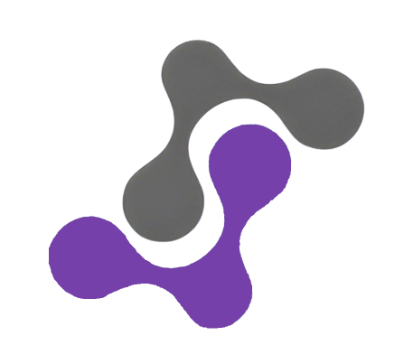

<h2 style="display: flex; align-items: center; gap: 4px;" > Synapse </h2>

<p style="text-align: justify;"><strong>Synapse</strong> is an innovative project designed to automate tasks by integrating widely used technologies like <code>Google Drive</code>, <code>Discord</code>, <code>Slack</code>, and <code>Notion</code>. The core concept revolves around creating a visual graph where each technology is represented as a node, facilitating seamless data flow through <strong>interconnected</strong> nodes. This project significantly simplifies automation, enabling users to streamline their workflows efficiently.</p>


## Dashboard


## Workflows

<ol>
    <li style="font-weight:600;">Visual Graph Interface:</li>
    <ul>
        <li style="text-align: justify;"> 
            Each tool (like Google Drive, Discord, Notion, Slack) is shown as a node in a visual graph. For non-technical users, these nodes can be seen as cards.
        </li>
        <li style="text-align: justify;">
            Nodes are connected by lines (called edges) that show how data flows from one node to another.
        </li>
    </ul>
    <li style="font-weight:600;">Triggers and Actions:</li>
    <ul>
       <li style="text-align: justify;"> 
            The workflow starts from a single node, called the root node. This node has a trigger, which is an event we want to keep track of, like a new file being added to Google Drive.</li>
        <li style="text-align: justify;">
            When the root node's trigger is activated, it starts the workflow by telling its connected nodes (child nodes) to perform their actions.
            These child nodes then tell their own child nodes to perform actions, and this continues down the line.
        </li>
    </ul>
    <li style="font-weight:600;">Managing the Workflow:</li>
    <ul>
        <li style="text-align: justify;">
            You can choose any node to be the root node by changing its parent trigger, but only one node can be the root node at a time.
            The workflow keeps running until you unpublish it. When you unpublish the workflow, the root node stops receiving updates and the workflow stops.
        </li>
    </ul>
</ol>


## Pricing: Plan for everyone

<br/><br/>

## Want to built your own version?

Step 1: Fork or download this repo.
Step 2: Run `pnpm i or npm i` to install the node_modules.
Step 3: Run the development server:

```bash
npm run dev
# or
pnpm dev
```
